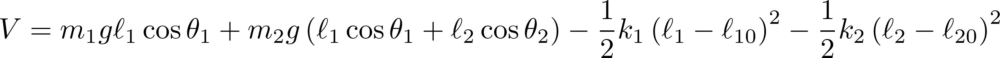

# Elastic Double Pendulum

Twitter bot that generates and posts videos of a double elastic pendulum. The bot
works by integrating the Lagrangian equations of motion for a two-dimensional double
spring pendulum.

  

  

  

  

  

